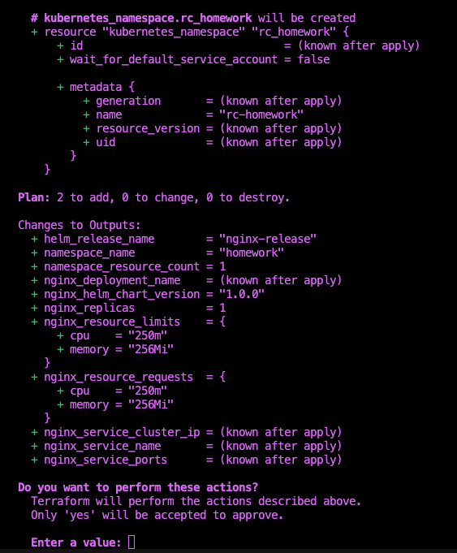
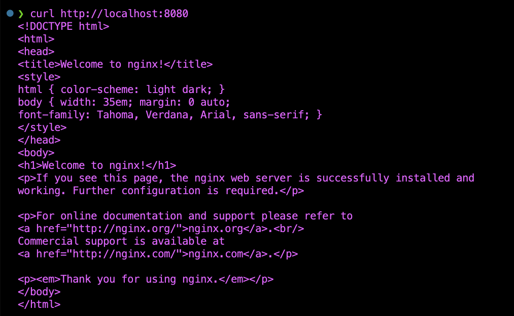

# Troubleshooting Report

The initial project repository provided contained various bugs and configuration errors that prevented the system from functioning as intended. This document outlines the troubleshooting process undertaken to identify and resolve each issue. It provides a step-by-step account of the problems encountered, the methods used to diagnose them, and the solutions implemented to restore full functionality.

## Charts

### Chart.yaml

- Updated `appVersion` to reflect latest stable version of Nginx - `1.16.0` to `1.27.3`.

### Values.yaml

- Identified a version mismatch. Updated `tag version` field to reflect changes to app version in `Chart.yaml` - `1.21-latest` to `1.27.3`.
- Resource requests exceeded limits for both `memory (256Mi)` and `CPU (250m)`. Resource requests, `CPU` and `Memory`, should be equal to or less than their respective limits ensuring consistent allocation without overcommitment. Adjusted resource requests to match limits for all fields.
- Experienced `nil pointer error evaluating interface {}.annotations`. An empty `annotations` map was added to pass requirement.

### Templates/services.yaml

- Reviewed fields and identified an error with `.Values.service.sourcePort`. These spec are a 1:1 mapping of fields details in `values.yaml`. The `sourcePort` field is not a required and present field. Updated `.Values.service.sourcePort` to `.Values.service.port` to reflect valid configurations.

### Template/deployment .yaml

- No errors errors were found, however the container name field was updated from `app` to `nginx-container` to reflect services running within the container for easier readability.

### Helm Package

- The custom Helm chart was packaged after incorporating necessary changes and adjustments, ensuring simplified portability and streamlined installation.

## Terraform

### Missing Configurations

#### Providers.tf

- Configured Terraform to use the Kubernetes and Helm providers, specifying the required versions to ensure compatibility and functionality.
- Configured the Kubernetes provider to interact with the cluster using the Minikube `kubeconfig`.
- Configured the Helm provider to deploy charts to the Kubernetes cluster using the same Minikube `kubeconfig` for authentication and connection.

#### Helm-Release.tf

- This resource block defines the deployment of an Nginx Helm release to a Kubernetes cluster. The configuration is fully parameterized, with values dynamically sourced from `variables.tf`, `locals.tf`, and `user_input.tfvars`.
  - `name`: Specifies the release name, sourced from a variable.
  - `chart`: Points to the local path of the Helm chart (`local.chart_path`).
  - `version`: Sets the chart version, defined in var.chart_version.
  - `namespace`: Determines the Kubernetes namespace for deployment, configured via var.namespace.
  - `values`: Applies custom values from an external YAML file (`local.file_path`).
- This setup promotes reusability and ensures consistent deployment configurations across environments.

#### Variables.tf

- Only used to define the logic for configurable input variables for the Terraform configuration.
- Only contains `description` and `type` fields, while values are expressed in locals.tf or user_input.tfvars.
- Benefits for separating logic from values include but are not limited to:
  - Ease of Maintenance
  - Separation of concerns
  - Reusability and Portability
  - Collaboration and Clarity

#### Locals.tf

- Contains computed values or derived variables that simplify the Terraform configuration. These are typically based on expressions or other variables, providing a centralized way to manage reusable logic.

#### User_Input.tfvars

- Assign specific values to input variables defined in `variables.tf`.
- Allows users to customize the configuration for different environments or use cases without modifying the core Terraform code.

#### Outputs.tf

- Defines and exposes key information from the Terraform configuration, like resource details, for use in other modules or display.

#### Data.tf

- Queries and retrieves existing infrastructure data for use in the current configuration.
- Allows Terraform to read attributes of external resources or those managed outside the current configuration, enabling dynamic resource configuration and better integration with pre-existing infrastructure.

### Modifications

#### Namespace.tf

- Moved the Kubernetes provider configuration from `namespace.tf` to a dedicated `providers.tf` file for improved organization and clarity, ensuring provider settings are centralized.
- Namespace name did not match service.yaml configurations. Changed namespace name and resource name from `rc-homework` to `homework`.

## Validations

### Terraform

### CLI

### Browser

