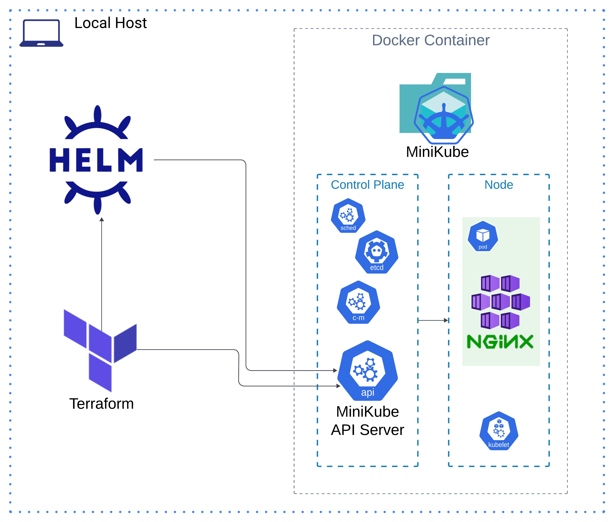

# Overview

This project automates the setup of a local Kubernetes environment using Minikube, Terraform, and Helm. It provisions a single-node Kubernetes cluster with an NGINX service running on it.



## Requirements

| Tool        | Description                                            | Version     |
|-------------|--------------------------------------------------------|-------------|
| [Terraform](https://developer.hashicorp.com/terraform/install) |  Infrastructure as Code (IaC) to provision and manage Minikube resources. | ~>&nbsp;1.10 |
| [Helm](https://helm.sh/docs/intro/quickstart/) | A package manager for Kubernetes used to deploy the NGINX service on the cluster.| ~>&nbsp;3.14.0  |
| [Minikube](https://minikube.sigs.k8s.io/docs/start/?arch=%2Fmacos%2Farm64%2Fstable%2Fbinary+download) | A local Kubernetes cluster environment for running Kubernetes workloads. Note: Installs Docker and Kubectl latest stable version as default dependencies. | ~>&nbsp;1.34.0 |

## Providers

| Name | Version |
|------|---------|
| <a name="provider_kubernetes"></a> [kubernetes]([#provider\_kubernetes](https://registry.terraform.io/providers/hashicorp/kubernetes/latest)) | ~>&nbsp;2.35.1 |
| <a name="provider_helm"></a> [helm]([#provider\_helm](https://registry.terraform.io/providers/hashicorp/helm/latest)) | ~>&nbsp;2.17.0 |

## Modules

No modules.

## Resources

| Name | Type |
|------|------|
| [kubernetes_namespace.rc_homework](https://registry.terraform.io/providers/hashicorp/kubernetes/latest/docs/resources/namespace) | resource |
|[helm_release.nginx](https://registry.terraform.io/providers/hashicorp/helm/latest/docs/resources/release)|resource|

## Inputs

|Name|Description|Type|Required|
|----|-----------|----|--------|
|[kubernetes_namespace.rc_homework.metadata](https://registry.terraform.io/providers/hashicorp/kubernetes/latest/docs/resources/namespace#metadata-1)|Standard namespace's metadata. |list(object({...}))|Yes|
|[kubernetes_namespace.rc_homework.metadata[0].name](https://github.com/kubernetes/community/blob/master/contributors/devel/sig-architecture/api-conventions.md#metadata)|Uniquely identifies this object within the current namespace|string|No|
|[helm_release.nginx.name](https://registry.terraform.io/providers/hashicorp/helm/latest/docs/resources/release#name-1)|Release name. The length must not be longer than 53 characters.|string|yes|
|[helm_release.nginx.chart](https://registry.terraform.io/providers/hashicorp/helm/latest/docs/resources/release#chart-1)|Chart name to be installed. A path may be used.|string|yes|
|[helm_release.nginx.version](https://registry.terraform.io/providers/hashicorp/helm/latest/docs/resources/release#version-1)|Specify the exact chart version to install. If this is not specified, the latest version is installed.|string|no|
|[helm_release.nginx.namespace](https://registry.terraform.io/providers/hashicorp/helm/latest/docs/resources/release#namespace-1)|Namespace to install the release into. Defaults to "default".|string|no|
|[helm_release.nginx.values](values)|List of values in raw yaml format to pass to helm.|List(string)|no|

## Outputs

|Name|Description|
|----|-----------|
|namespace_name|The namespace where the NGINX release is deployed|
|helm_release_name|The name of the Helm release|
|nginx_service_name|The name of the Kubernetes service created for the NGINX release|
|nginx_replicas|The number of replicas for the NGINX deployment|
|nginx_deployment_name|The name of the Kubernetes deployment for NGINX|
|nginx_service_cluster_ip|The ClusterIP of the NGINX service|
|nginx_service_ports|The ports exposed by the NGINX service|
|nginx_resource_limits|The resource limits for the NGINX pods|
|nginx_resource_requests|The resource requests for the NGINX pods|
|nginx_helm_chart_version|The version of the Helm chart used for the NGINX release|
|namespace_resource_count|The total count of resources in the namespace|

## Usage

### Repository

Clone github repo.

````bash
git clone https://github.com/alchmst333/rc_homework.git
````

### MiniKube

Start MiniKube cluster locally using docker containers.

````bash
minikube start --driver=docker
````

Confirm build was successful.

````bash
# fetch list of pods for all namespaces in minikube cluster
kubectl get po -A

# Check status of minikube cluster and view details about 
# components and their state.
minikube status

# Confirm KubeConfig exists and contains relevant configurations. 
cat ~/.kube/config
````

### Terraform

Initialize terraform configuration:

````bash
terraform init
````

Plan and create resources:

````bash
terraform apply -var-file="user-inputs.tfvars"
````

Destroy resources.

````bash
terraform destroy -var-file="user-inputs.tfvars"
````

### Testing

````bash
# Get list of pods associated with the provided namespace.
kubectl get pods -n homework

# Get list of services associated with the provide namespace.
kubectl get service -n homework

# Verify helm chart has successfully been released.
helm list --namespace homework

# SSH | Forward local port to pod for access.
kubectl port-forward pod/<pod_name> 8080:80 -n homework

# Curl local host. Output should serve NGINX welcome page.
curl http://localhost:8080

````

### Helm Overrides

To override configurations found in values.yaml using, run the following commands:

````bash
helm install rc-homework ./rc-homework-<version>.tgz \
    --set replicaCount=<number> \
    --set image.tag=<version>
````
